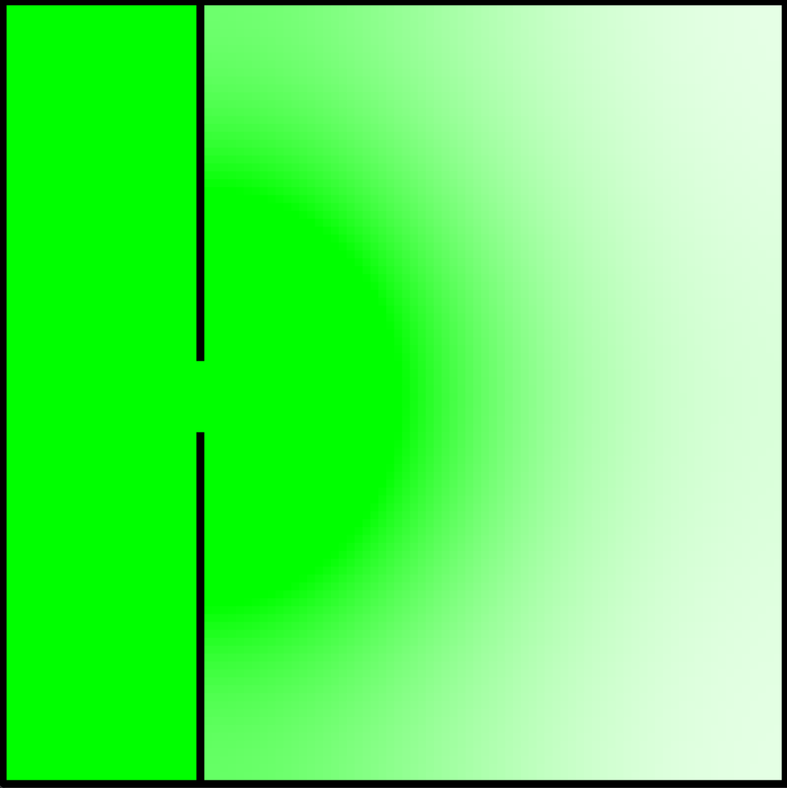

# Modelowanie dyskretne

Bitmapowanie, lab 2 i lab 3 realizują edycje obrazów i podstawowe operacje (erozje, dylatacje, operacje otwarcia, zamknięcia ...). Nie są one obszernie opisane ponieważ zawierają pliki *.bmp obrazujące działanie funkcji. W realizacji wykorzystano biblioteki:

- PIL
- numpy
- matplotlib.pyplot

## Gra w życie:

Projekt "Gra w życie" realizuje automat komórkowy Conway'a. W implementacji posłużyłem się biblioteką pygame 2.4.1 do wizualizacji i stworzenia prostego GUI (zdjęcie poniżej). Zaimplementowałem możliwość dodawania w czasie rzeczywistym podstawowych wzorów oraz zmiane warunków brzegowych

  

## Labirynt

Projekt Implementuje symulacje labiryntu, w którym użytkownik może:

- samemu stowrzyć przestrzeń labiryntu wraz z łowcami
- wybrać już istniejącą mapę (zdjęcie poniżej) 

  

Dalej z bazy danych użytkownik wgrywa uciekinierów umieszczając ich w opdowiednich miejscach w Labiryncie. Zarówno uciekinierzy (kolor złoty), jak i łowcy (kolor czerwony) do osiągnięcia celu używają algortymu astar, natomiast uciekinierzy dodatkowo mają dodany element podstawowego q-learningu w czasie trwania symulacji. Celem łowcy jest złapanie najbliższefo uciekiniera, a uciekiniera unikanie łowców i dotarcie do wyjścia (kolor zielony). Oboje mogą poruszać się tylko i wyłącznie po korytarzach (kolor biały). Baza danych obsługiwana jest na localhost z kontenera docker-owego. GUI zaimplementowane przy użyciu pygame:

  

## LGA:

W folderze zawarta jest implementacja nie tylko LGA, ale również dyfuzji LBM oraz przepływu LBM. O ile do realizacji LGA podszedłem w inny sposób - tworząc klasę środowiska i cząsteczek - to dyfuzje LBM zdefiniowałem jako macierz 3 wymiarową - x,y,tablica gęstości zmierzającej w odpowiednich kierunkach z sąsiedztwa von Neumanna, natomiast przepływ LBM dziedziczy z dyfuzji ale rozszerza tablicę gęstości do 9 kierunków zgodnie z sąsiedztwem Moore'a. W obu przypadkach LBM użyłem biblioteki Numba w celu zrównoleglenia obliczeń. Wyniki dla każdego z algorytmów po kolei:

- LGA
  

  

- LBM dyfuzja
  

  

- LBM przepływ
  

  

