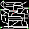

# Modelowanie dyskretne

Bitmapowanie, lab 2 i lab 3 realizują edycje obrazów i podstawowe operacje (erozje, dylatacje, operacje otwarcia, zamknięcia ...). Nie są one obszernie opisane ponieważ zawierają pliki *.bmp obrazujące działanie funkcji. W realizacji wykorzystano biblioteki:

- PIL
- numpy
- matplotlib.pyplot

## Gra w życie:

Projekt "Gra w życie" realizuje automat komórkowy Conway'a. W implementacji posłużyłem się biblioteką pygame 2.4.1 do wizualizacji i stworzenia prostego GUI (zdjęcie poniżej). Zaimplementowałem możliwość dodawania w czasie rzeczywistym podstawowych wzorów oraz zmiane warunków brzegowych

  

## Labirynt

Projekt Implementuje symulacje labiryntu, w którym użytkownik może:

- samemu stowrzyć przestrzeń labiryntu wraz z łowcami
- wybrać już istniejącą mapę (zdjęcie poniżej) 

  

Dalej z bazy danych użytkownik wgrywa uciekinierów umieszczając ich w opdowiednich miejscach w Labiryncie. Zarówno uciekinierzy, jak i łowcy do osiągnięcia celu używają algortymu astar, natomiast uciekinierzy dodatkowo mają dodany element podstawowego q-learningu w czasie trwania symulacji. Celem łowcy jest złapanie najbliższefo uciekiniera, a uciekiniera unikanie łowców i dotarcie do wyjścia. Baza danych obsługiwana jest na localhost z kontenera docker-owego. GUI zaimplementowane przy użyciu pygame:

  

